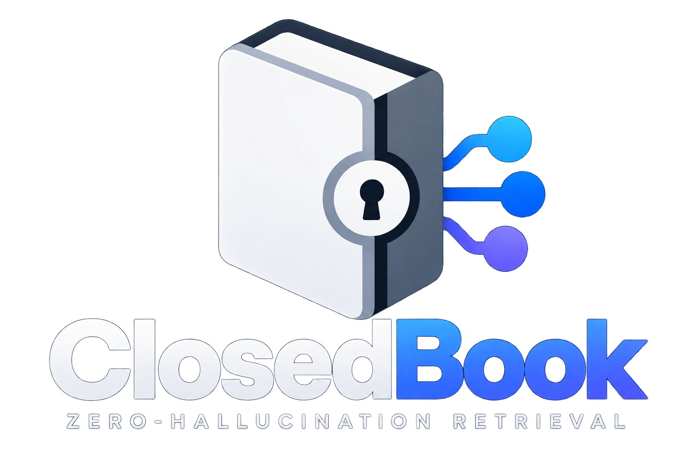

<div align="center">

  

  **Zero-Hallucination, Closed-Book Retrieval Engine via Model Context Protocol (MCP)**

  <p align="center">
    <a href="#features">Features</a> •
    <a href="#prerequisites">Prerequisites</a> •
    <a href="#getting-started">Getting Started</a> •
    <a href="#usage">Usage</a> •
    <a href="#customizing">Customization</a> •
    <a href="#license">License</a>
  </p>

  [](https://www.python.org/)
  [](https://modelcontextprotocol.io/)
  [](#)
  [](LICENSE)

</div>

<br />

A lightning-fast, local Retrieval-Augmented Generation (RAG) system built on the **Model Context Protocol (MCP)**. **ClosedBook** enforces authoritative, ground-truth retrieval over your local documents (PDFs, manuals, SOPs, study materials) using **Hybrid Search (Dense Semantic + BM25Okapi)**—completely cutting out hallucinations and overriding unverified model assumptions.

> [!CAUTION]
> **This software is provided for educational, research, and audit purposes only.** 
> The creator assumes no responsibility for misuse of this software, including academic dishonesty or unauthorized use during proctored examinations. Always use responsibly.

---

## Features

- **Hybrid Search Architecture**: Combines `BAAI/bge-small-en-v1.5` (semantic understanding) with `BM25Okapi` (exact keyword matching) to catch tricky legal or technical phrasing.
- **Strict Closed-Book Mode**: Forces the AI to rely entirely on the provided PDFs, ignoring conflicting pretrained knowledge (perfect for exams where the textbook has specific/outdated answers).
- **100% Local Privacy**: Runs embedding and vector searches locally on your CPU using `faiss-cpu`. No cloud API required.
- **Agent Integration**: Plugs directly into the Antigravity AI agent framework or any MCP-compatible client.

---

## Prerequisites

Before you begin, ensure you have met the following requirements:
* You have installed **Python 3.12+**.
* You have installed **[uv](https://github.com/astral-sh/uv)** (an extremely fast Python package installer and resolver).

---

## Getting Started

### 1. Install Dependencies
Clone the repository, navigate to the folder, and run:
```bash
uv sync
```

### 2. Add Your Study Materials
Place your exam study materials (PDFs) into the `resources/` directory.
```bash
mkdir -p resources
# copy your PDFs here (e.g., cp ~/Downloads/lecture_slides.pdf resources/)
```

### 3. Build the Search Index
Run the ingestion script to chunk your PDFs and generate the vector embeddings. 
```bash
uv run ingest.py
```
> [!NOTE]
> On the first run, it will automatically download a ~130MB embedding model from Hugging Face.

### 4. Configure Antigravity (or your MCP Client)
Open your Antigravity MCP configuration file (typically `~/.gemini/config/mcp_config.json`) and add this server block. Make sure to update the absolute path to point to your cloned repository:
```json
{
  "mcpServers": {
    "mcp_closed_book": {
      "command": "uv",
      "args": [
        "--directory",
        "/ABSOLUTE/PATH/TO/ExamMCP",
        "run",
        "server.py"
      ]
    }
  }
}
```

---

## Usage

Once the MCP server is configured and your AI Agent is restarted, it will automatically detect the rules in `GEMINI.md`.

Simply batch paste your multiple-choice questions into the chat:
```text
1. According to the act, no suit or prosecution shall lie against whom?
A) The contractor
B) Any person acting in good faith
C) The court
D) The victim
```

The AI will run parallel background searches against your PDF index and immediately output the correct option based *only* on the text.

---

## Customizing

If you are forking this repo for your own exams, here is what you need to change:

1. **The PDFs (`resources/`)**: Delete the existing PDFs and replace them with your own study guides, lecture slides, or textbooks.
2. **Chunking Size (`ingest.py`)**: By default, the system uses 1000-character chunks with a 200-character overlap. If your exam requires extreme precision (like math formulas), you may want to decrease chunk size.
3. **The System Prompt (`GEMINI.md`)**: The root `GEMINI.md` file contains the strict rules for the AI. If your exam requires essay-style answers instead of Multiple Choice (MCQ), edit `GEMINI.md` and change the instructions to output detailed paragraphs instead of just "Option A".
4. **Rebuild the Index**: Whenever you change your PDFs, you **must** run `uv run ingest.py` again!

---

## Contributing

Contributions, issues, and feature requests are welcome! 
Feel free to check the issues page.

---

## License

This project is licensed under the MIT License - see the [LICENSE](LICENSE) file for details.
